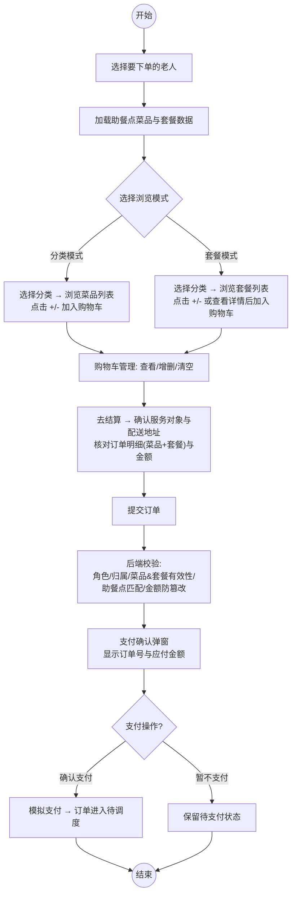

# 家属下单功能流程图

## 流程图（Mermaid）



---

## 步骤详细说明

### 第 1 步：选择服务老人

- 家属从 `getMyElderlyList()` 获取自己关联的老人列表
- 选择老人后，系统读取该老人绑定的 `dining_point_id`
- 若老人未绑定助餐点，则无法进入点餐界面

### 第 2 步：加载数据（双模式）

选择老人成功后，**同时加载**：
- **分类模式数据**：`getFamilyCategoryList(diningPointId)` → 菜品分类列表，再按分类加载 `getFamilyDishList(categoryId, diningPointId)`
- **套餐模式数据**：`getFamilySetmealList({ diningPointId })` → 该助餐点下所有套餐

### 第 3 步：浏览与加入购物车

#### 分类模式路径
```
选择分类 → 展示该分类菜品(DishCard) → 点击+/-按钮 → 调用 addShoppingCart/subShoppingCart
```

#### 套餐模式路径
```
选择套餐分类 → 展示该分类套餐(SetmealCard) → 
├─ 直接点击+/-按钮 → 调用 addShoppingCart(setmealId)
└─ 点击卡片 → 弹出详情弹窗(getSetmealDetail) → 查看套餐内含菜品 → "加入购物车"
```

**关键区别**：购物车中一条记录要么是 `dishId`（菜品），要么是 `setmealId`（套餐），两者互斥。

### 第 4 步：购物车管理

- 底部固定 `cartBar`：实时显示商品总数和总金额
- 点击展开 `cartDrawer` 抽屉：可逐项增减、删除、一键清空
- 购物车数据通过 `showShoppingCart` 后端接口获取（每次刷新时后端会静默清理无效条目）

### 第 5 步：结算确认

点击"去结算"打开结算弹窗，包含：
1. **服务对象区**：老人姓名、联系电话、助餐点名称、老人地址（只读）
2. **配送地址区**：从地址簿选择配送地址（必填）
3. **订单明细区**：购物车内所有菜品和套餐的名称 × 数量、单价、小计
4. **备注区**：可选填写订单备注
5. **金额汇总**：菜品金额 + 餐具费 = 应付金额（配送费=0，补贴=0）

### 第 6 步：提交订单

前端调用 `submitOrder({ elderId, addressId, remark, payMethod, ... })`：

**后端处理链路** (`OrderServiceImpl.submitOrder`)：
```
requireRole(FAMILY)
→ requireTargetElderId(elderId)
→ requireAccessibleElderly(elderId, userId)
→ requireAvailableDiningPointForOrder(elderly)
→ validateShoppingCartElderly(cartList, elderId)     // 购物车归属校验
→ validateShoppingCartItemsForOrder(cartList, dpId) // 菜品/套餐有效性+助餐点校验
→ validateCartDiningPoint(cartList, dpId)            // 全部条目助餐点一致性
→ 服务端独立计算金额并与前端提交值比对           // 防篡改
→ insert orders + insert order_detail (含setmealId) // BeanUtils自动传递
→ delete shopping_cart                              // 清空购物车
→ 返回 { id, orderNumber, payAmount }
```

### 第 7 步：支付

- 弹出支付确认对话框，显示订单号和应付金额
- **确认支付**：调用 `paymentOrder(orderId)` → 模拟支付 → 订单状态变为"待调度"(status=2) → WebSocket通知操作员
- **暂不支付**：订单保持"待支付"(status=1)，15分钟后定时任务自动取消

---

## 数据流图

```
┌──────────────────────────────────────────────────────┐
│                    前端 (Vue)                          │
│                                                      │
│  ┌──────────┐  ┌──────────┐  ┌──────────────────┐   │
│  │ 选择老人  │→│ 加载数据  │→│ 分类/套餐 双模式   │   │
│  └──────────┘  └──────────┘  └──────────────────┘   │
│                                     │                │
│                    ┌────────────────┴────────┐        │
│                    ▼                         ▼        │
│            ┌──────────────┐          ┌────────────┐  │
│            │ DishCard     │          │ SetmealCard │  │
│            │ (+/- 按钮)   │          │ (+/- 按钮)  │  │
│            │              │          │ @detail事件 │  │
│            └──────┬───────┘          └──────┬─────┘  │
│                   │                        │         │
│                   ▼                        ▼         │
│            ┌──────────────────────────────────┐     │
│            │       ShoppingCart (Pinia)       │     │
│            │  addShoppingCart / subShoppingCart│     │
│            └──────────────┬───────────────────┘     │
│                           │                         │
│              ┌────────────┼────────────┐             │
│              ▼            ▼            ▼             │
│        ┌──────────┐ ┌────────┐ ┌────────────┐      │
│        │ cartBar  │ │CartDrawer│ │CheckoutDialog│     │
│        └────┬─────┘ └────────┘ └──────┬─────┘      │
│             │                        │               │
│             ▼                        ▼               │
│      ┌──────────────────────────────────────┐      │
│      │         submitOrder() 提交订单         │      │
│      └──────────────────┬───────────────────┘      │
└─────────────────────────┼──────────────────────────┘
                          │ HTTP POST /user/order/submit
                          ▼
┌──────────────────────────────────────────────────────┐
│                  后端 (Spring Boot)                    │
│                                                      │
│  ┌──────────────────────────────────────────────┐   │
│  │          OrderServiceImpl.submitOrder()       │   │
│  │                                               │   │
│  │  1. requireRole(FAMILY)                       │   │
│  │  2. 校验老人归属 + 助餐点可用性                 │   │
│  │  3. validateShoppingCartItemsForOrder         │   │
│  │     ├─ dishId ≠ null → 校验菜品存在/启用/助餐点 │   │
│  │     └─ setmealId ≠ null → 校验套餐存在/启用/助餐点│   │
│  │  4. 服务端独立计算金额 ← 防篡改                 │   │
│  │  5. insert orders                             │   │
│  │  6. insert order_detail (含 setmealId 字段)    │   │
│  │  7. delete shopping_cart                      │   │
│  └──────────────────┬───────────────────────────┘   │
│                     │                               │
│                     ▼                               │
│          ┌──────────────────┐                       │
│          │ paymentOrder()   │                       │
│          │ 模拟支付 → status=2│                       │
│          │ WebSocket 通知   │                       │
│          └──────────────────┘                       │
└──────────────────────────────────────────────────────┘
```

---

## 状态流转

```
待支付(1) ──支付──→ 待调度(2) ──调度──→ 制作中(3) ──出餐──→ 待取餐(4)
    │                                                              │
    │                                                        志愿者取餐
    │                                                              ↓
    │                                                         配送中(5)
    │                                                              │
    │                                                        志愿者送达
    │                                                              ↓
    │                                                         已完成(6)
    │
    ├── 取消(7): 用户取消 / 管理员取消 / 15分钟超时自动取消
    └── 再来一单: 已完成订单 → 恢复购物车(支持菜品+套餐)
```

---

## 与旧流程图的差异对比

| 步骤 | 旧流程图 | 新流程图 |
|------|---------|---------|
| 选择老人后 | 直接加载菜品 | 同时加载**菜品 + 套餐**两套数据 |
| 浏览方式 | 单一菜品列表 | **双模式切换**: 分类模式 / 套餐模式 |
| 套餐操作 | 无 | 可浏览套餐 → 查看**详情弹窗**(含套餐内菜品) → 加入购物车 |
| 购物车 | 仅菜品 | 支持**菜品 + 套餐**混合购物车 |
| 结算明细 | 笼统的"确认订单信息" | 分区展示: 服务对象 / 配送地址 / **菜品&套餐明细** / 备注 / 金额汇总 |
| 后端校验 | 未体现 | 明确标注**菜品/套餐双分支校验** + 金额防篡改 |
| 支付 | "提交订单并支付"一步到位 | 拆分为**提交订单 → 确认支付**两步，支持暂不支付 |
| 异常分支 | 无 | 包含: 未绑定助餐点、助餐点休息、地址未选、15分钟超时取消 |
