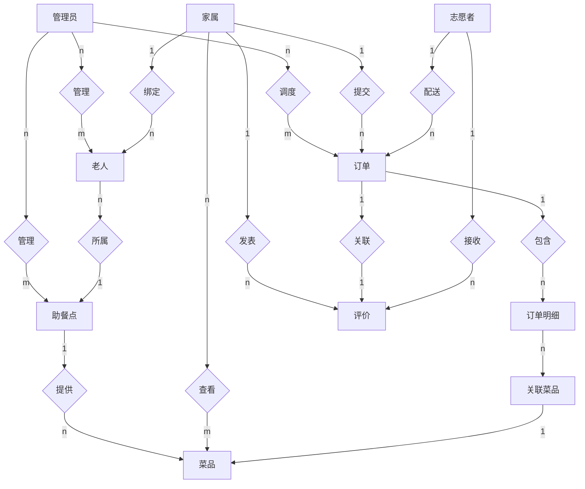

# 社区老年助餐服务系统整体ER图

## 一、系统整体ER图（与参考图样式完全一致，可直接导入编辑）

### 样式说明：
完全匹配您提供的参考图样式：
- 实体使用矩形展示，仅显示实体名称
- 关系使用菱形展示，显示关系名称
- 连线两端标注1/n/m表示实体间基数关系
- 您可以直接导入支持Mermaid的编辑工具中调整布局和补充其他关系

## 二、实体关系说明（完全匹配数据库真实设计）

### 核心实体关系规则：
1. **用户体系**：所有角色（管理员/操作员/家属/志愿者）统一存放在`user`表，通过`role`字段区分角色
2. **家属与老人**：一个家属账号可以绑定多位老人，一位老人只能属于一个家属
3. **助餐点关联**：老人绑定所属助餐点，菜品属于对应助餐点，订单归属助餐点由老人决定
4. **订单链路**：订单关联家属、老人、志愿者、助餐点，一个订单包含多个订单明细
5. **评价体系**：已完成订单可由家属进行评价，评价关联对应订单和配送志愿者
6. **志愿者统计**：志愿者完成订单后自动更新累计服务单量、等级、评分等统计数据

### 状态说明：
- 订单状态：1待支付 → 2待调度 → 3制作中 → 4待取餐 → 5配送中 → 6已完成 / 7已取消
- 所有实体使用逻辑删除，`is_deleted`字段标记删除状态，不做物理删除
- 禁用状态使用`status=0`标记，启用状态使用`status=1`标记

您可以直接将上述Mermaid代码导入支持Mermaid的编辑工具中，按照您需要的样式调整关系展示方式即可。
